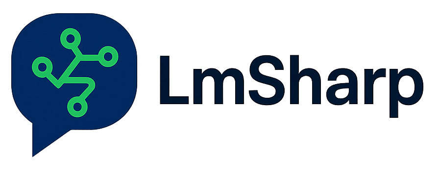

A lightweight .NET client library for interacting with LM Studio's local LLM server API. Supports chat completions, model management, structured output, and tool use.

[](https://www.nuget.org/packages/LmsSharp/)
[](https://opensource.org/licenses/MIT)
[](https://github.com/Ddemon26/Lmss/actions/workflows/build.yml)

## Installation

### From Source
Clone and build the project:
```bash
git clone https://github.com/Ddemon26/Lmss.git
cd Lmss
dotnet build
```

### NuGet Package
```bash
dotnet add package LmsSharp
```

### Local Development
Reference the project directly in your `.csproj`:
```xml
<ProjectReference Include="path/to/Lmss/Lmss.csproj" />
```

## Requirements

- .NET Standard 2.0 or .NET 8.0
- LM Studio running locally on port 1234

## Quick Start

```csharp
using LmsSharp;

var client = new LmsClient();
var models = await client.GetModelsAsync();
Console.WriteLine($"Available models: {models.Count}");
```

## Features

- OpenAI-compatible API client
- Chat completions with streaming support
- Model management and health checks
- Structured JSON output
- Tool use and function calling
- Async/await support
- Cross-platform compatibility (.NET Standard 2.0 and .NET 8.0)

## Contributing

Contributions are welcome! Please feel free to submit issues, feature requests, or pull requests.

## License

This project is licensed under the MIT License - see the LICENSE file for details.

## Support

- [LM Studio Documentation](https://lmstudio.ai/docs)
- [GitHub Issues](https://github.com/Ddemon26/Lmss/issues)
- [API Reference](https://github.com/Ddemon26/Lmss/wiki)